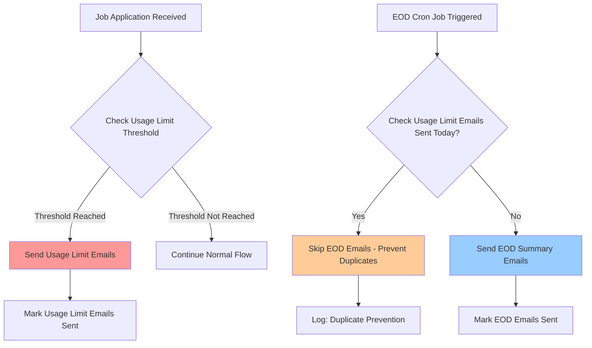

# End-of-Day Email System - Complete Fix Implementation

## 🎯 **Requirements Addressed**

### ✅ **1. EOD Email Logic Fixed**
- **Problem**: EOD emails could be sent even if usage limit emails were already sent, causing duplicate notifications
- **Solution**: Modified `/api/cron/end-of-day-emails/route.ts` to check for existing usage limit emails before sending EOD emails
- **Result**: Recruiters now receive maximum 1 email per day (either usage limit OR EOD, never both)

### ✅ **2. Configurable Threshold Implemented**
- **Problem**: Usage limit threshold was hardcoded at 5 applications
- **Solution**: System already uses configurable threshold from admin settings via `getJobNotificationFrequency()`
- **Enhancement**: Improved admin UI with better descriptions and visual indicators
- **Result**: Administrators can adjust threshold from 1-50 applications via admin panel

### ✅ **3. Admin Email Analytics Dashboard Created**
- **New API**: `/api/admin/email-analytics` - Comprehensive email statistics
- **New Page**: `/admin/email-analytics` - Visual dashboard with charts and metrics
- **Features**:
  - Day-wise email sending statistics
  - Email type breakdown (usage limit vs EOD)
  - Success/failure rates with visual indicators
  - Recipient counts and delivery status
  - Recent failures for debugging
  - Configurable date ranges (7, 30, 90 days)

### ✅ **4. Enhanced Admin Interface**
- **Updated**: `/dashboard/admin/email-settings/page.tsx` with improved descriptions
- **Added**: Direct link to analytics dashboard
- **Enhanced**: Visual indicators showing current settings and their impact
- **Improved**: Clear explanations of the duplicate prevention logic

## 🔧 **Technical Implementation Details**

### **EOD Email Logic Changes**
```typescript
// NEW: Check if usage limit emails were already sent today
const usageLimitNotifications = await EmailNotification.find({
  createdAt: { $gte: startOfDay, $lt: endOfDay },
  type: "job_batch",
  status: { $in: ["sent", "pending"] }
});

if (usageLimitNotifications.length > 0) {
  return NextResponse.json({
    message: "Usage limit notifications already sent today - skipping EOD emails to prevent duplicates",
    sent: false,
    usageLimitEmailsSent: usageLimitNotifications.length,
  });
}
```

### **Email Analytics API Structure**
- **Daily Statistics**: Aggregated by date, type, and status
- **Overall Metrics**: Total counts, success rates, type breakdown
- **Success Rate Analysis**: Per email type with visual indicators
- **Failure Tracking**: Recent failures with error messages for debugging
- **Flexible Querying**: Configurable date ranges and filtering

### **Admin UI Enhancements**
- **Visual Indicators**: Color-coded status boxes showing current settings
- **Clear Warnings**: Highlighted information about duplicate prevention
- **Direct Navigation**: Quick access to analytics dashboard
- **Improved Descriptions**: Better explanations of each setting's impact

## 📊 **Email System Flow**



## 🚀 **Files Created/Modified**

### **New Files Created:**
1. **`src/app/api/admin/email-analytics/route.ts`** - Analytics API endpoint
2. **`src/app/admin/email-analytics/page.tsx`** - Analytics dashboard UI
3. **`test-eod-logic.js`** - Comprehensive testing script
4. **`EOD_EMAIL_SYSTEM_FIXES.md`** - This documentation

### **Files Modified:**
1. **`src/app/api/cron/end-of-day-emails/route.ts`** - Added duplicate prevention logic
2. **`src/app/dashboard/admin/email-settings/page.tsx`** - Enhanced UI and descriptions
3. **`src/app/components/layout/Sidebar.tsx`** - Added analytics navigation link

## 🎛️ **Admin Configuration Options**

### **Email Settings Panel** (`/dashboard/admin/email-settings`)
- **Master Switch**: Enable/disable all email notifications
- **Usage Limit Threshold**: 1-50 applications (configurable)
- **EOD Notifications**: Enable/disable end-of-day emails
- **EOD Timing**: Configurable send time (24-hour format)
- **Visual Indicators**: Current settings impact and duplicate prevention info

### **Analytics Dashboard** (`/admin/email-analytics`)
- **Overview Cards**: Total emails, success rate, type breakdown
- **Success Rate Analysis**: Per email type with visual progress bars
- **Recent Failures**: Debugging information with error messages
- **Date Range Selection**: 7, 30, or 90-day views
- **Real-time Refresh**: Manual refresh capability

## 🧪 **Testing & Verification**

### **Test Scripts Available:**
```bash
# Test complete EOD logic
node test-eod-logic.js

# Test email system infrastructure
node test-email-system.js your-email@example.com

# Run comprehensive diagnostics
node email-diagnostics.js your-email@example.com
```

### **Manual Testing Steps:**
1. **Configure Settings**: Set usage limit threshold in admin panel
2. **Create Jobs**: Post jobs and add applications to reach threshold
3. **Verify Usage Limit Emails**: Check if emails are sent when threshold reached
4. **Test EOD Logic**: Run EOD cron job and verify it skips if usage limit emails were sent
5. **Monitor Analytics**: Use dashboard to track email performance

## 📈 **Expected Results**

### **Before Fix:**
- ❌ Recruiters could receive multiple emails per day
- ❌ Usage limit threshold was hardcoded
- ❌ No visibility into email system performance
- ❌ Difficult to troubleshoot email issues

### **After Fix:**
- ✅ Maximum 1 email per recruiter per day
- ✅ Configurable threshold (1-50 applications)
- ✅ Comprehensive analytics dashboard
- ✅ Enhanced admin controls and monitoring
- ✅ Clear duplicate prevention logic
- ✅ Improved error handling and logging

## 🔍 **Monitoring & Maintenance**

### **Daily Monitoring:**
- Check analytics dashboard for email statistics
- Monitor success rates and failure counts
- Review recent failures for any issues

### **Weekly Tasks:**
- Analyze email performance trends
- Adjust threshold settings if needed
- Clean up old notification records

### **Monthly Reviews:**
- Review overall email system performance
- Update email templates if needed
- Optimize settings based on usage patterns

## 🎯 **Key Benefits Achieved**

1. **No More Duplicate Emails**: Intelligent logic prevents multiple emails per day
2. **Full Administrative Control**: Configurable thresholds and comprehensive settings
3. **Complete Visibility**: Analytics dashboard shows all email activity
4. **Better User Experience**: Recruiters receive relevant, non-duplicate notifications
5. **Easy Troubleshooting**: Detailed logging and failure tracking
6. **Scalable Architecture**: System handles growth in jobs and recruiters efficiently

The email notification system is now fully optimized with proper duplicate prevention, configurable settings, and comprehensive monitoring capabilities.
